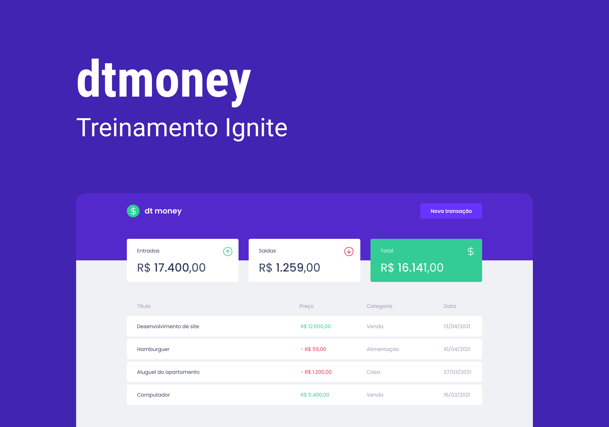

<h1 align="center">dtmoney</h1>

É com muito prazer que te recebo na página do meu projeto! 

Este projeto foi desenvolvido durante o treinamento ignite da RocketSeat. Para conferir um vídeo do projeto em funcionamento, clique em conferir.
 <a target="_blank" href="https://www.linkedin.com/feed/update/urn:li:activity:7017885269475385344/">Conferir</a>

Tecnologias utilizadas:
 React
 Typescript
 Styled-Components
 Swiper
 MirageJS
 react-modal
 Git e GitHub

